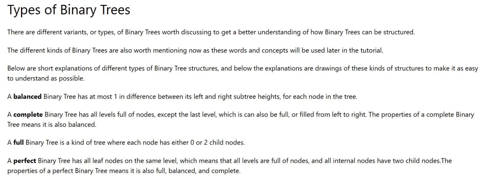
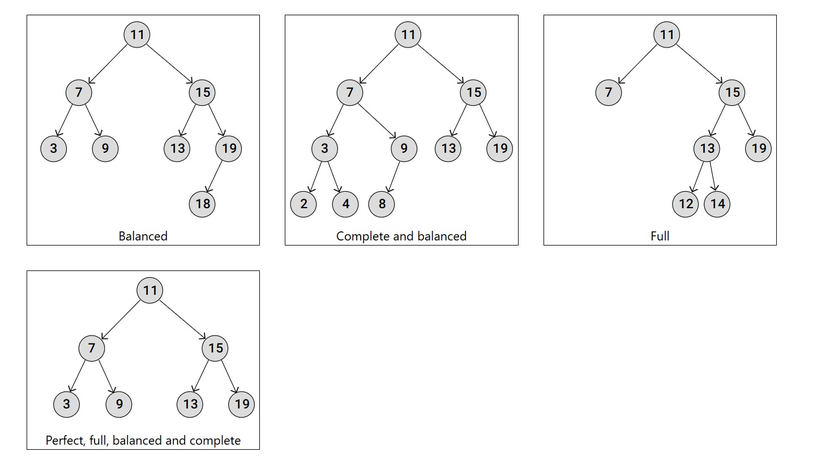

## 📌 Overview

A binary tree is a data structure where:
- Each node contains **data**
- Each node can have **at most two children**: `left` and `right`

This example manually constructs a binary tree and demonstrates how nodes are connected and accessed.

---

## 🧱 TreeNode Class

```python
class Treenode:
    def __init__(self, data):
        self.data = data
        self.left = None
        self.right = None
```

Each node stores:
- `data` → the value of the node
- `left` → reference to the left child
- `right` → reference to the right child

---

## 🌳 Tree Construction

```python
root = Treenode("r")
nodea = Treenode("a")
nodeb = Treenode("b")
nodec = Treenode("c")
noded = Treenode("d")
nodee = Treenode("e")
nodef = Treenode("f")
nodeg = Treenode("g")
nodez = Treenode("z")

root.left = nodea
root.right = nodeb
nodea.left = nodec
nodea.right = noded
nodeb.left = nodee
nodeb.right = nodef
nodef.left = nodeg
noded.right = nodez
```

### Tree Structure (Conceptual)

```
        r
       / \
      a   b
     / \ / \
    c  d e  f
        \  /
         z g
```

---

## 🔍 Accessing Node Data

```python
print("root.right.left.data: ", root.right.left.data)
print(nodeb.right.left.data)
```

### Output
```
root.right.left.data:  e
g
```

This demonstrates how to traverse the tree using references.

---

## 📚 Types of Binary Trees

### 1️⃣ Binary Tree Example


---

### 2️⃣ Balanced, Complete, Full, and Perfect Trees


- **Balanced**: Height difference between left and right subtrees ≤ 1
- **Complete**: All levels filled except possibly the last (filled left to right)
- **Full**: Each node has 0 or 2 children
- **Perfect**: All internal nodes have 2 children and all leaves are on the same level

---

### 3️⃣ Binary Tree Definitions


---

## ✅ Summary

- Demonstrates a **manual binary tree construction**
- Shows **node linking and traversal**
- Explains **key binary tree types with visuals**
- Ideal for **learning data structures fundamentals**

---

## 🚀 Next Steps

- Implement tree traversals (Inorder, Preorder, Postorder)
- Add search or insert operations
- Convert to a Binary Search Tree (BST)

Happy coding! 🌱
